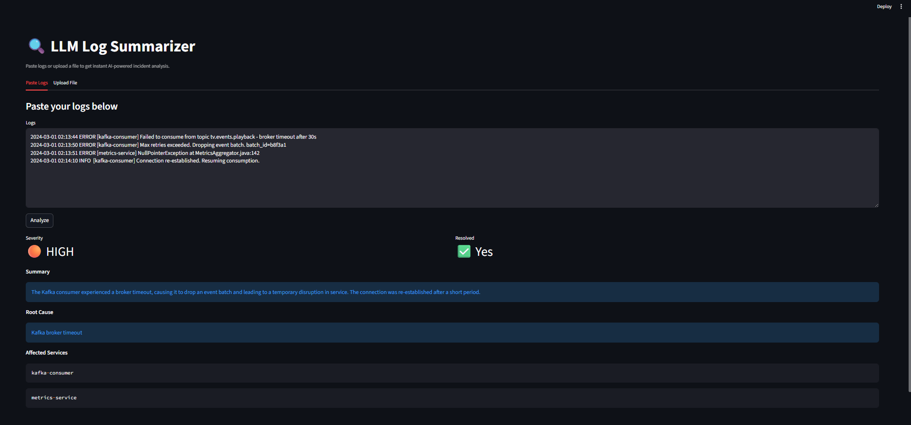
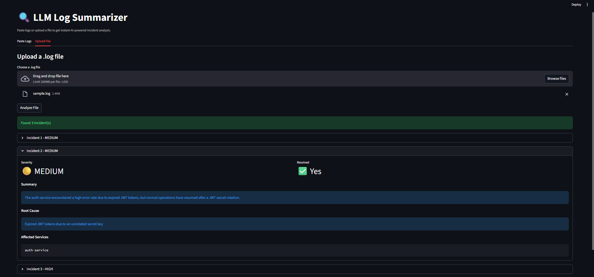

# LLM Log Summarizer

An AI-powered tool that analyzes application logs and returns structured 
incident summaries including attributes like severity, root cause, affected services, and resolution status.

Built with FastAPI, Groq (LLaMA 3.3), and Streamlit.






---

## Features

- Paste raw logs and get instant AI analysis
- Upload a `.log` file and get per-incident summaries
- Severity classification: CRITICAL / HIGH / MEDIUM / LOW
- Detects affected services and resolution status
- REST API with auto-generated docs at `/docs`

---

## Tech Stack

| Layer      | Tool                        |
|------------|-----------------------------|
| LLM        | LLaMA 3.3 via Groq API      |
| Backend    | FastAPI + Uvicorn           |
| Frontend   | Streamlit                   |
| Validation | Pydantic                    |
| Language   | Python 3.11                 |

---

## Project Structure
```
llm-log-summarizer/
├── app.py          # Streamlit UI
├── main.py         # FastAPI backend
├── summarizer.py   # LLM summarization logic
├── chunker.py      # Log chunking by incident
├── sample.log      # Sample log file for testing
└── .env            # API keys (not committed)
```

---

## Getting Started

### 1. Clone the repo
```bash
git clone https://github.com/Freny-S/LLM-Log-Summarizer.git
cd llm-log-summarizer
```

### 2. Set up environment
```bash
python -m venv venv
source venv/bin/activate  # Windows: venv\Scripts\activate
pip install -r requirements.txt
```

### 3. Add your Groq API key
Create a `.env` file:
```
GROQ_API_KEY=your_key_here
```

### 4. Run the backend
```bash
uvicorn main:app --reload
```

### 5. Run the UI
```bash
streamlit run app.py
```

Open `http://localhost:8501` in your browser.

---

## API Endpoints

| Method | Endpoint     | Description                        |
|--------|--------------|------------------------------------|
| GET    | `/health`    | Health check                       |
| POST   | `/summarize` | Summarize pasted logs              |
| POST   | `/upload`    | Batch summarize an uploaded file   |

---

## Sample Output
```json
{
  "severity": "HIGH",
  "summary": "Kafka consumer lost broker connection and dropped an event batch.",
  "root_cause": "Kafka broker timeout due to network instability.",
  "affected_services": ["kafka-consumer", "metrics-service"],
  "resolved": true
}
```
